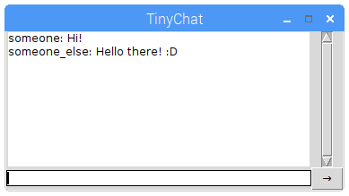

<p align="center">
    
</p>

<p align="center">
    
</p>

# 💬 TinyChat

[](https://github.com/MartinKondor/TinyChat) [](https://github.com/MartinKondor/TinyChat)  [](https://github.com/MartinKondor/TinyChat/issues)

Chat program.

## Getting Started

### Prerequisites

* Python 3.X

### Steps

1. Start the program from the command line with `$ python3 .` in TinyChat's directory.
2. Set your name and the partner's IP address.
    * You can check your IP by using `$ ifconfig eth0 || ipconfig`
3. Set the server option to Yes or No.
    * **A server and a NOT server is necessary for working connection.**

### In chat commands

* To rename yourself during chat conversation, type in: `/setname <NEW NAME>`
* To reconnect, type in: `/re`
* To set the partner's IP address, type in: `/ip <IP>`

## Contributing

Ways to contribute:

* Check for open issues
* Read the ```TODO``` file

### Steps

1. Fork this repository
2. Create a new branch (optional)
3. Clone it
4. Make your changes
5. Upload them
6. Make a pull request here

## Authors

* **[MartinKondor](https://github.com/MartinKondor)**
* **[szmol96](https://github.com/szmol96)**

## License

Copyright &copy; Martin Kondor 2021

This repository is licensed under the ```BSD 3-Clause``` license.
See the [LICENSE](./LICENSE) file for more details.
